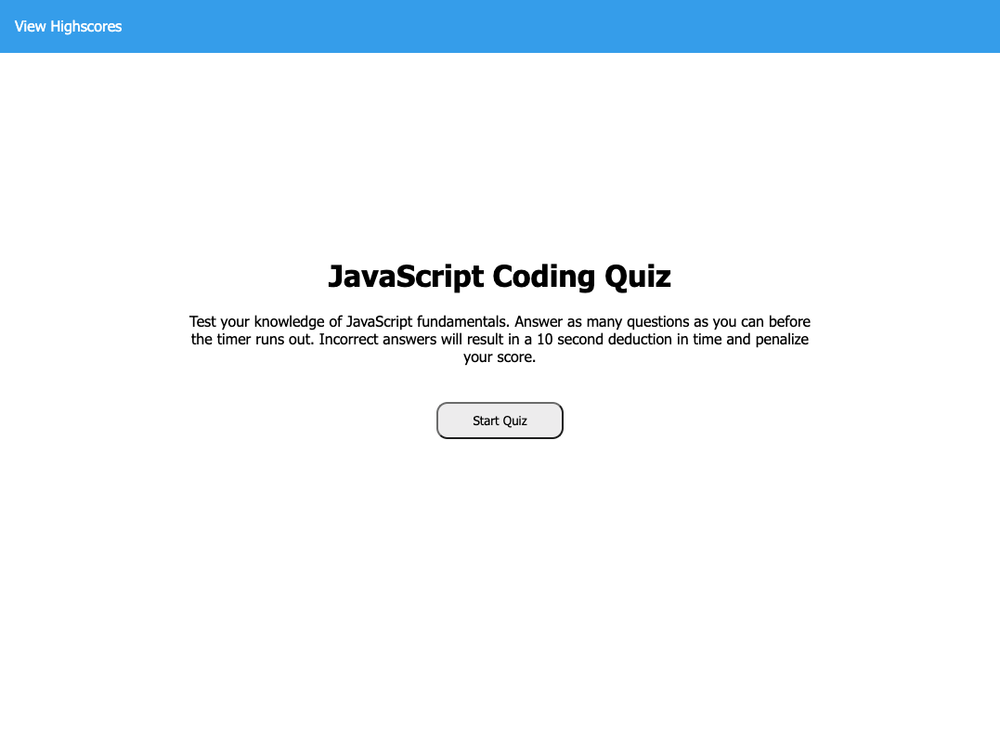
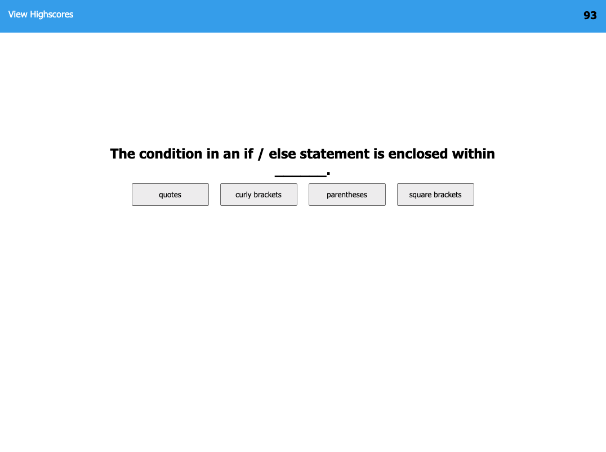
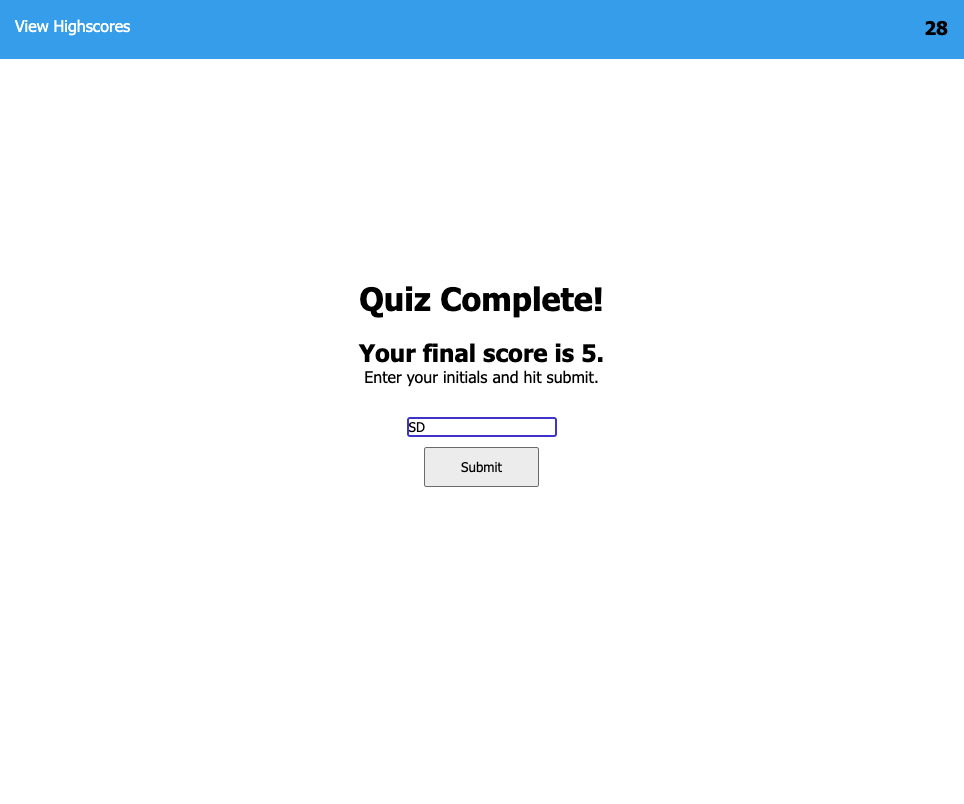

# JavaScript Code Quiz

## Description
This webpage contains a quiz to test a user's knowledge of JavaScript coding fundamentals.

This game-like quiz not only tests a user's knowledge of JavaScript, but it also allows them to save and submit their scores to a list of highscores.

By creating this quiz, I have demonstrated the use of various JavaScript tools.

## Installation

N/A

## Usage

Upon clicking the start button, a timer begins counting down from 60 seconds.
* The user is presented with a question and four multiple-choice answer buttons.

If they answer a question correctly, a point is added to their score.
* A new question will display after the first is answered.

If a question is answered incorrectly, 10 seconds will be deducted from the timer.
* A new question will display after that.

After answering all of the questions, or once the timer runs out, the quiz is over.
* The user will be presented with their score.
* The user will also have the option to enter their initials and submit their score to the highscores.

## Credits

N/A

## Link to Deployed Website

[JavaScript Coding Quiz](https://smdann.github.io/javascript-code-quiz/)

## License

MIT License

Copyright (c) 2022 smdann

Please refer to the license in the repo for more information.